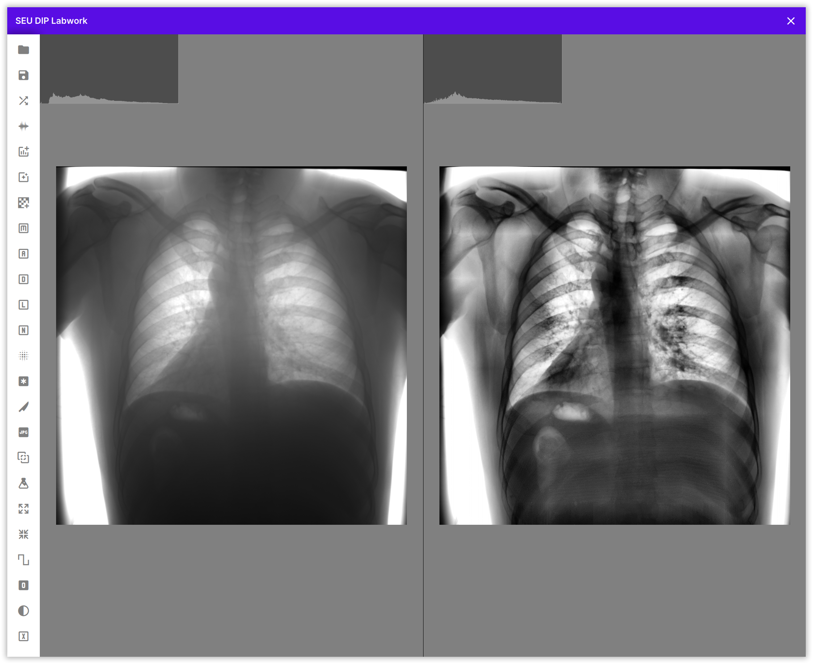

# SEU-DIP-Labwork

本项目为东南大学2021级计算机科学与技术专业数字图像处理实验。

## 📸 屏幕截图



## ✨ 快速开始

### Requirements

- `Qt >= 6.5`
- `CMake >= 3.20`
- `ninja` or other build system (unverified)
- `MSVC` or other C++ compiler (unverified)
- `OpenCV >= 4.0`

### 构建方法

指定 OpenCV 以及 Qt SDK 位置进行构建即可。

下面是使用 vcpkg 管理 OpenCV，使用 MSVC+Ninja 构建的命令。

```
mkdir build && cd build
cmake -DCMAKE_TOOLCHAIN_FILE=path/to/vcpkg.cmake -DCMAKE_PREFIX_PATH=path/to/qt/sdk -G Ninja -DCMAKE_CXX_COMPILER=cl ..
ninja
```

## 🧪 实验内容

#### 实验一 程序总体框架

- ✅ 搭建整体 GUI 框架（ 支持显示多幅图像 ）
- ✅ 实现读取 bmp 图像并进行傅里叶变换
- ✅ 实现直方图显示
- ✅ 实现直方图均衡化
- ✅ 实现 CLAHE 算法

#### 实验二 噪声与降噪

- ✅ 加入高斯噪声
- ✅ 加入椒盐噪声
- ✅ 实现中值处理
- ✅ 实现均值处理
- ✅ 实现自适应中值处理
- ✅ 实现 Nonlocal means 算法

#### 实验三 图像增强

- ✅ 实现基于二阶导数的图像增强
- ✅ 实现非锐化掩蔽
- ✅ 实现自适应局部降低噪声滤波

#### 实验四 图像压缩

- ✅ 实现 JPEG 压缩
- ✅ 实现 JPEG2000 压缩

#### 实验五 形态学与图像分割

- ✅ 膨胀与腐蚀操作
- ✅ Global Thresholding 与 Otsu's Thresholding
- ✅ Canny 算子

#### 实验六 略

#### 实验七 医学影像处理 略
